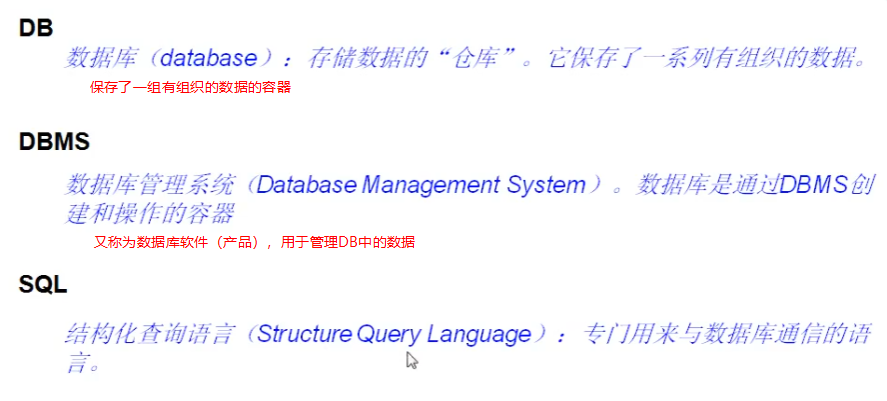
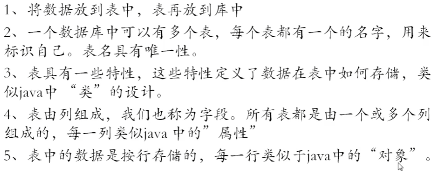
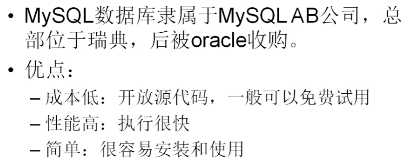
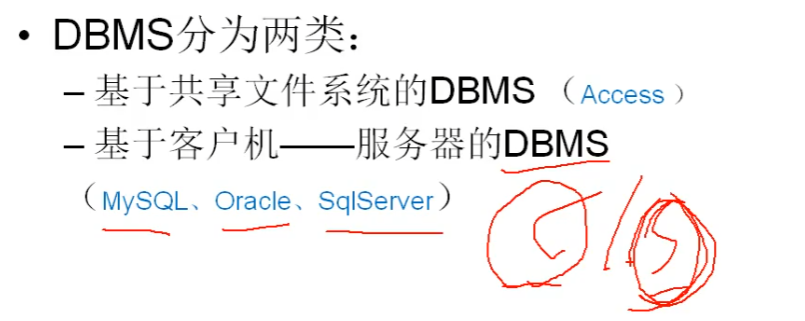
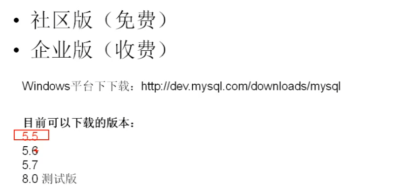
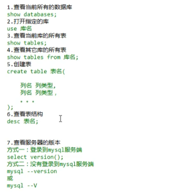
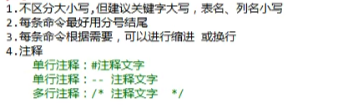

# day01

## 1.数据库相关概念

### 几个术语

### 常见的数据库管理系统：

MySQL、Oracle、DB2、SQLServer

### SQL的优点

## 2.数据库存储数据的特点

## 3.MySQL软件介绍

### 4.DBMS的分类

第二类基于C/S架构，C指client，S指Server，一般来说服务端比较重要，所以说一般说安装数据库是指安装服务端。

### 5.MySQL的版本

### 6.MySQL软件的安装

略

### 7.MySQL服务的启动和停止

两种方式

方式一：通过mysql自带的客户端

方式二：通过windows自带的客户端

登陆：

mysql -h 主机名 -P 端口号 -u 用户名 -p密码   （这是用于远程登陆的）

如果只是登陆本机的，可以简写为

mysql -u 用户名 -p密码

退出：

ctrl+c或exit或quit

### 8.配置环境变量

略，网上有。

### 9.MySQL的常见命令

### 10.MySQL的语法规范

### 11.图形化用户界面客户端安装与介绍

安装过程略。

### 

