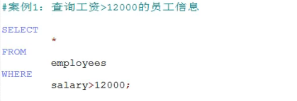
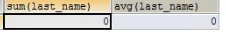
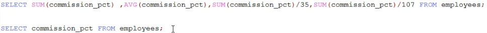
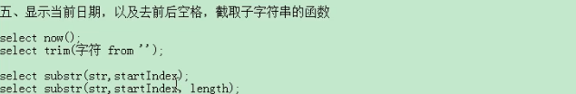
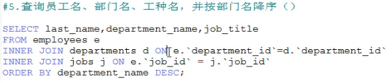
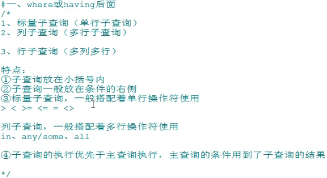
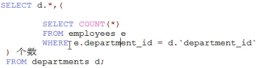
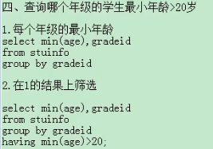
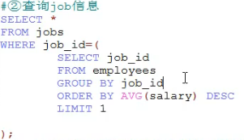

# day02

### SQL语言的学习大纲

## 1.myemployees的四张表的介绍

## 2.基础查询介绍

### 2.1进阶一：基础查询

#### 2.1.1语法

select 查询列表 from 表名;

类似于：System.out.println();

特点：

1、查询列表可以是：表中的字段、常量值、表达式、函数；

2、查询的结果是一个虚拟的表格

#### 2.1.2查询表中的单个字段

select last_name from employees;

#### 2.1.3查询表中的多个字段

select las_name,salary,email from employees;

#### 2.1.4查询表中的所有字段

方式一：

selcect 

​			employee_id,

​			first_name,

​			... 

from 

​			employees;

方式二：

select * from employees;

#### 注意事项

使用 use 库名 的方式指定操作的数据库

#### 2.1.5查询常量、表达式、函数

！！ 查询常量值

select 100;

select 'john';

！！查询表达式

select 100*98;

！！查询函数

select version();

！！起别名

①便于理解

②如果要查询的字段有重名的情况，使用别名可以区分开来

% 方式一：

select 100%98 as 结果;(对字段起别名：结果)

select last_name as 姓, first_name as 名 from employees;

% 方式二：

select last_name 姓, first_name 名 from employees;

#案例：查询salary，显示结果为out put

select salary as "out put" from employees;（使用双引号或单引号将含有特殊符号的引起来）

#### 2.1.6去重

#案例：查询员工表中涉及到的所有部门编号

select department_id from employees;==>存在重复的值

改为：

select distinct department_id from employees;==>不存在重复的值

#### +号的作用

%Java中的+号：

①运算符，两个操作数都为数值型

②连接符，只要有一个操作数为字符串

%mysql中的+号：

仅仅只有一个功能：运算符

select 100+90; 两个操作数都为数值型，则做加法运算

select '123'+90;有一方为字符型，试图将字符型数值转换成数值型，

​								如果转换成功，则继续做加法运算

​								如果转换失败，则将字符型数值转换成0

select 'john'+90;

select null+10; 只要其中一方为null，则结果肯定为null

#案例：查询员工名和姓连接成一个字段，并显示为 姓名

select last_name+first_name as 姓名 from employees;==>不能达到预期效果，原因见上面的分析

应该用concat:

select concat('a','b','c') as 结果;

select concat(last_name,first_name) as 姓名;

#### 案例讲解

第六题中由于commission_pct存在null而导致查询出来的都会为null，所以需要条件判断：基本思路是如果为null就置0否则保持原始值。

### 2.2进阶二：条件查询

#### 语法

#### 分类

#### 按条件表达式筛选

#### 按逻辑表达式筛选

或

#### 模糊查询

##### like

使用escape关键字指定转义字符：

##### between and

##### in

##### is null

这种写法不行，因为=号不能判断null，需要用is判断：

##### 安全等于

**is null vs. <=>**

#### 条件查询案例讲解

#### 测试题

**答案**

如果换成OR，结果就一样！

### 进阶三：排序查询

#### 引入

通过这种方式查询的表格不具备排序的功能

#### 语法

#### 特点

#### 案例

改进一下，由于表达式太长了，按照别名进行排序：

#### 测试题

答案：

### 进阶四：常见函数

#### 概念和好处

#### 调用

#### 特点

#### 分类

#### 学习目标

#### 字符函数

#### 数学函数

#### 日期函数

#### 其他函数

#### 流程控制函数

#### **总结**

#### 测试题

#### 分组函数

##### 功能

##### 分类

##### 简单使用

##### 特点

======================================================================

参数支持类型

**SUM**、**AVG**一般用于处理**数值型**。

如果使用字符类型：

输出结果将为：

不具实际意义！

**MAX**除了支持数值型，还支持字符型（因为可以排序！）

**COUNT**也都支持

========================================================================

用以下语句判断是否忽略null值：

上段语句的输出为：

由此判断，SUM和AVG是忽略null值的。

输出为：

所以也是忽略null值。

=========================================================================

和distinct搭配

输出为：

输出为：

=========================================================================

count函数的详细介绍

=========================================================================

效率：

MYISAM存储银旗下，COUNT(*)的效率高

INNODB存储效率下，COUNT(*)和COUNT(1)的效率差不多，比COUNT(字段)要高一些

=========================================================================

和分组函数一同查询的字段有限制

这段语句得出的结果为：

发现employee_id这一列没有什么意义。

**总结**

#### 测试

#### 进阶五：分组查询

##### 引入

上面这种方法只能求出所有员工工资的平均值。

##### 语法

##### 注意

##### 案例

=========================================================================

=========================================================================

=========================================================================

注意GROUP BY之后的字段顺序可以任意。

=========================================================================

##### 特点

##### 案例讲解

#### 进阶六：连接查询

##### 含义

##### 笛卡尔乘积现象

**发生原因：**

没有有效的连接条件

**解决办法：**

添加连接条件

以上语句为了区分id在id前添加了表名

##### 分类

=========================================================================

##### sql92标准

**等值连接**

为了防止冗余：

**下面这种用法会报错：**

所以，起了别名之后及只能用别名

可以调换顺序。

**总结：**

语法：

=========================================================================

**非等值连接**

语法：

=========================================================================

**自连接**

语法：

=========================================================================

##### 测试题

=========================================================================

##### 作业讲解

=========================================================================

##### sql99标准

=========================================================================

**内连接**

注意，三个表之间的顺序不能随意放置，前一个表必须与后一个表存在可连接关系，例如下面这段语句就不能执行，因为jobs和department之间不能连接。

**特点**

=========================================================================

**非等值连接**

=========================================================================

**自连接**

=========================================================================

**外连接**

=========================================================================

**全外连接**

由于mysql不支持这种语法，所以无法得到结果。

=========================================================================

**交叉连接**

=========================================================================

##### sql92 vs. sql99

##### 连接总结

=========================================================================

##### 案例讲解

=========================================================================

#### 进阶七：子查询

##### 含义

##### 分类

=========================================================================

##### 标量子查询

以上是老做法，下面给出行子查询的做法：

=========================================================================

=========================================================================

 

=========================================================================

=========================================================================

##### 案例讲解-子查询

.

=========================================================================

#### 进阶八：分页查询

##### 应用场景

##### 语法

##### 案例

##### 总结/特点

=========================================================================

##### 测试题3讲解P96

##### 子查询经典案例讲解P98

第2题解法一：

第2题解法二：

##### 作业讲解P99

=========================================================================

#### 进阶九：联合查询

##### 引入案例

方法一：

方法二：

##### 语法

或

~~~mysql
查询语句1
union 【all】
查询语句2
union 【all】
...
~~~

##### 应用场景

用于当要查询的结果来自多个表，并且多个表之间没有连接关系，但查询的信息一致时。

##### 特点

1.要求多条查询语句的查询列数是一致的；

2.要求多条查询语句的查询的每一列的类型和顺序最好一致；

3.使用union关键字默认去重，如果使用union all可以包含重复项。

##### 意义

1、将一条比较复杂的查询语句拆分成多条语句
2、适用于查询多个表的时候，查询的列基本是一致

=========================================================================

#### 查询总结

语法：

~~~mysql
select 查询列表		     ⑦
from 表1 别名		      ①
连接类型 join 表2         ②
on 连接条件               ③
where 筛选               ④
group by 分组列表         ⑤
having 筛选              ⑥
order by排序列表          ⑧
limit 起始条目索引，条目数;  ⑨
~~~

##### 基础查询

~~~mysql
select 查询列表		     ⑦
from 表1 别名		      ①
~~~

##### 条件查询

~~~mysql
select 查询列表		     ⑦
from 表1 别名		      ①
where 筛选               ④
~~~

##### 连接查询

~~~mysql
select 查询列表		     ⑦
from 表1 别名		      ①
连接类型 join 表2         ②
on 连接条件               ③
~~~

##### 连接+筛选

~~~mysql
select 查询列表		     ⑦
from 表1 别名		      ①
连接类型 join 表2         ②
on 连接条件               ③
where 筛选               ④
~~~

##### 连接+筛选+分组

~~~mysql
select 查询列表		     ⑦
from 表1 别名		      ①
连接类型 join 表2         ②
on 连接条件               ③
where 筛选               ④
group by 分组列表         ⑤
having 筛选              ⑥
~~~

##### 连接+筛选+分组+排序

~~~mysql
select 查询列表		     ⑦
from 表1 别名		      ①
连接类型 join 表2         ②
on 连接条件               ③
where 筛选               ④
group by 分组列表         ⑤
having 筛选              ⑥
order by排序列表          ⑧
~~~

=========================================================================