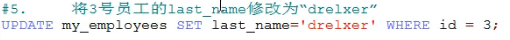
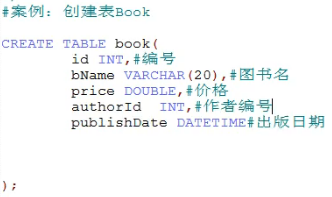
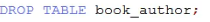
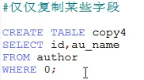
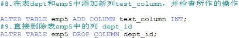
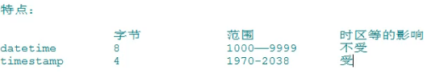
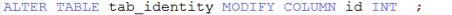

# day03

### DML语言——数据操作语言★ 

==插入：insert==

==修改：update==

==删除：delete==

### 一、插入语句

#### 语法一

~~~mysql
insert into 表名(字段名1,...) 
values(值1,...);
~~~

**要求：**

1、要求值的类型和字段的类型要一致或兼容
2、字段的个数和顺序不一定与原始表中的字段个数和顺序一致
	  但必须保证值和字段一一对应
3、假如表中有可以为null的字段，注意可以通过以下两种方式插入null值
	  ①字段和值都省略
  	②字段写上，值使用null
4、字段和值的个数必须一致
5、字段名可以省略，默认所有列

##### 规则与例子

##### 语法二

~~~mysql
insert into 表名 
set 字段1=值1,...;
~~~

##### 两种语法比较

#### 二、修改语句

##### 语法

修改多表又称为**级联更新**。

#### 三、删除语句

##### 方式一：delete

**注意delete后面可以跟表1,或表2或表1和表2，这与需要删除的内容所在表有关。**

<u>单表删除</u>中可以通过添加LIMIT关键字来实现删除指定行：

~~~mysql
delete from 表名 【where 筛选条件】【limit 条目数】
~~~

##### 案例

##### 方式二：truncate

##### 案例

##### ==两种方式的区别（面试题）==

truncate和delete之间的第三点区别：

#### 案例讲解——增删改

### DDL语言——数据定义语言

库和表的管理

#### 一、库的管理

##### 1.库的创建

~~~mysql
create database 【if not exists】 库名【 character set 字符集名】;
~~~

##### 2.库的修改

一般通过直接重命名文件夹实现库名修改（但是一般不要随意修改库名）

##### 3.库的删除

#### 二、表的管理

##### 1.表的创建

或

##### 2.表的修改

关于第三条，默认添加在最后，可以写为如下形式来指定插入的位置：

~~~mysql
alter table 表名 add column 列名 类型 【first|after 字段名】;
~~~

##### 3.表的删除

或

##### 4.表的复制

先给author表添加一些数据：

##### 案例讲解

### 常见的数据类型

#### 一、整型

#### 二、小数

##### 选择原则

#### 三、字符型

补充：ENUM类型

注意不区分大小写

补充：SET类型

注意不区分大小写

补充：其他

#### 四、日期型

### 常见约束

#### 含义

#### 分类：六大约束

#### 添加约束的时机

#### 约束的添加分类

#### ==主键与唯一的比较：==

注意，唯一允许非空的列中只允许存在唯一的null值，即如下语句执行会报错：

关于是否允许组合：

执行以下语句

查看stuinfo的结构为：

从中可以发现，表面上虽然有两个列名为主键，但实际只有一个，这可以从如下语句判断：

向表中插入数据：

发现能正确执行。

为不影响接下来的数据插入，先删除表中的数据，然后执行插入数据语句：

发现也能正确执行。

但是，执行如下语句则会报错：

所以，从这两个例子可以体会组合主键的意思。

#### 外键的说明

#### 一、创建表时添加约束

##### 1.添加列级约束

##### 2.添加表级约束

##### 通用的写法

#### 二、修改表时添加约束

##### 1.添加非空约束

#### 三、修改表时删除约束

##### 案例讲解

##### 列级约束和表级约束的对比

### 标识列

又称为自增长列。

#### 含义

#### 特点

#### 一、创建表时设置标识列

注意可以通过语句：

查询自增长的列/列名：

然后通过语句：

将步长设置为3：

#### 二、修改表时设置标识列

#### 三、修改表时删除标识列

