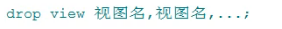
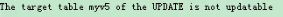
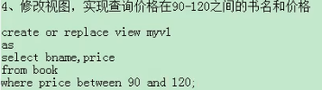
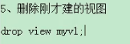
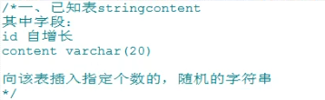

# day04

## TCL语言——事务控制语言

Transaction Control Language

### 事务

#### 存储引擎

#### ==事务的ACID属性（经典面试题）==

概括版：

#### 事务的创建

##### 隐式事务

##### 显示事务

设置自动提交功能为禁用的语句：

###### 步骤：

###### 演示事务使用步骤

###### 演示savepoint的使用

#### ==事务并发问题==

#### ==数据库事务的隔离性==

数据库系统必须具有隔离并发运行各个事务的能力，使它们不会相互影响，避免各种并发问题。

#### 在MySQL中设置隔离级别

### 视图

#### 含义

虚拟表，和普通表一样使用

mysql5.1版本出现的特性，是通过表动态生成的数据。

#### 应用场景

#### 示例

通过视图将其封装，以便多次使用

#### 视图的创建

#### 案例解析

#### 视图的好处

- 重用sql语句；
- 简化复杂的sql操作，不必一一知道它的查询细节；
- 保护数据，提高安全性。

#### 视图的修改

- 方式一

- 方式二

#### 视图的删除

#### 视图的查看（结构）

#### 案例讲解

#### 视图的更新

注意原始表中也会插入这行数据。

注意原始表中也会修改相应的数据。

注意原始表中也会删除相应的数据。

例如，以下语句会报错：

报错：

报错：

执行语句

会报错

执行

会报错：

执行

会报错：

#### ==视图与表的对比==

|      | 创建语法的关键字 | 是否实际占用物理空间 |             使用             |
| :--: | :--------------: | :------------------: | :--------------------------: |
| 视图 |   create view    |  只是保存了sql逻辑   | 增删改查，只是一般不能增删改 |
|  表  |   create table   |      保存了数据      |           增删改查           |

#### 测试题

### 变量

#### 系统变量

##### 说明

##### 使用的语法

##### 操作演示

#### 自定义变量

##### 说明

##### 使用步骤

##### 用户变量与局部变量的比较

## 存储过程和函数

类似于java中的方法

好处：

### 存储过程

#### 含义

#### 语法

##### 一、创建语法

**注意事项**：

##### 二、调用语法

##### 案例解析

#### 案例讲解

#### 二、删除存储过程

##### 语法

#### 三、查看存储过程的信息

#### 案例讲解（接上一个）

### 函数

#### 含义

好处：

#### 与存储过程的区别

#### 语法

##### 一、创建语法

**注意**

##### 二、调用语法

##### 案例演示

##### 三、查看函数

##### 四、删除函数

##### 案例

### 流程控制结构

#### 一、分支结构

##### 1.if函数

##### 2.case结构

##### 3.if结构

#### 二、循环结构

##### 分类

while、loop、repeat

##### 循环控制

##### 1.while

**语法**：

##### 2.loop

##### 3.repeat

##### 案例

##### 总结

#### 经典案例

